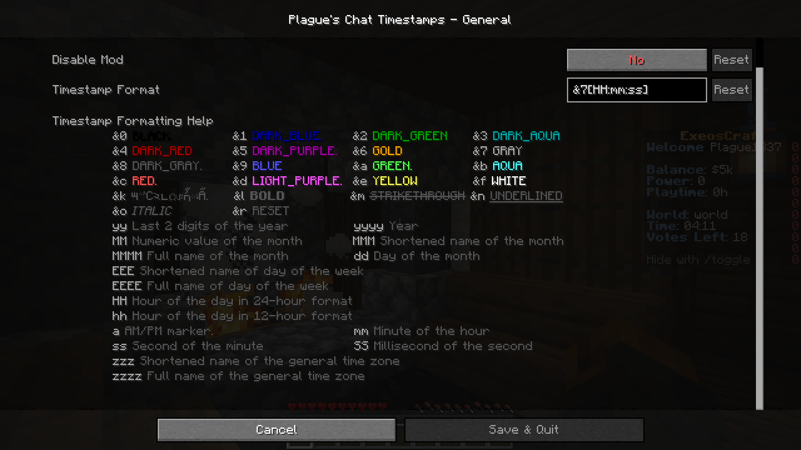
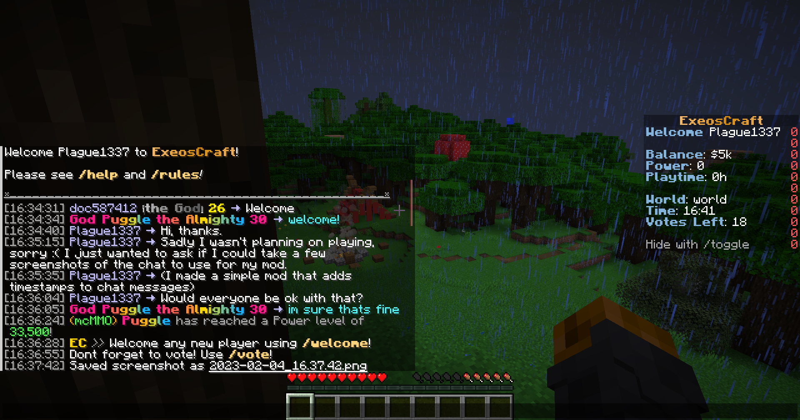
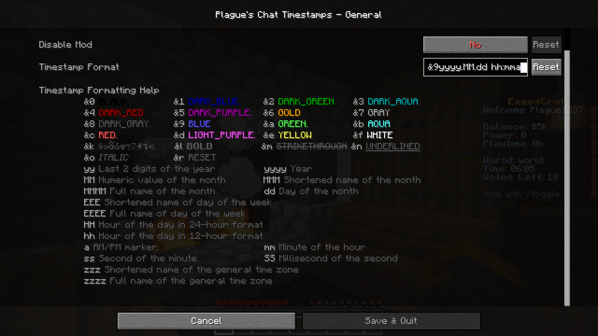
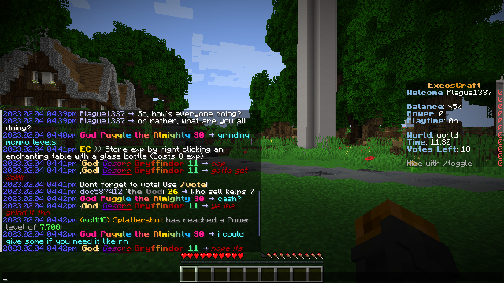

# Plague's Chat Timestamps

[][fabric]

A Fabric mod that adds customizable timestamps to chat!

## 📖 What is this mod?

This is a client-side mod made for [Fabric modloader][fabric] that allows users to add a customizable timestamp to their chat messages.

Have you ever returned to Minecraft after being AFK only to find that your friends have been messaging you and wondered when those messages were left?
With this mod, you'll never have to guess again!
The Timestamp mod adds timestamps to all chat messages, so you can easily see exactly when each message was sent.

The formatting along with the style of the timestamp can be customized.

Here are some screenshots!
\(Please note that I just joined a random server & asked for permission to take the screenshots.\)

## ✅ Features

- Automatic detection of timezone
- Format customization
 - Time formatting
   - 12-hour format / 24-hour format
   - Second
   - Millisecond
 - Date formatting
   - Year
   - Numerical month
   - Short and long name of month \(ex: "Feb", "February"\)
   - Numerical day of the month
   - Short and long name of the day of the week \(ex: "Sat", "Saturday"\)
   - Short and long name of time zone \(ex: "PST", "Pacific Standard Time"\)
- Style customization
  - Color customization
  - Bold, italic and underlined text
  
## 📖 Usage

Using this mod is very simple!

Put the jar file in your mods folder and you are good to go!

If you wish to be able to access the settings of the mod within the game; you will also need to put [ModMenu] and [Cloth Config API] in your mods folder.
You can also edit the configuration file found in config folder manually if you wish to do so.

## 📖 Compatibility

This mod should be compatible with every mod.

[fabric]: https://fabricmc.net
[ModMenu]: https://modrinth.com/mod/modmenu "ModMenu Modrinth page"
[Cloth Config API]: https://modrinth.com/mod/cloth-config "Cloth Config API Modrinth page"
